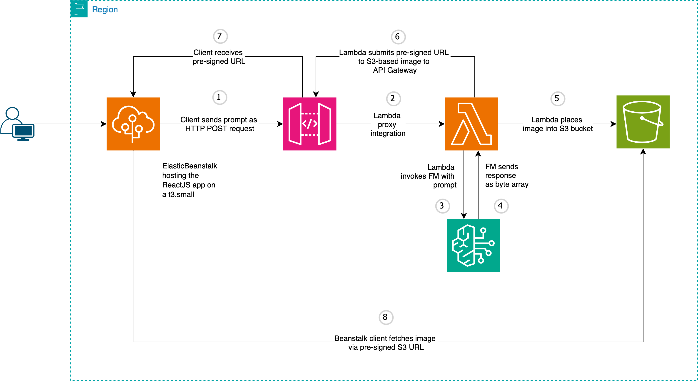

# Amazon Bedrock Image Generator


This project consists of a React application integrated with AWS to create and display generative AI images based on textual prompts. 
Users can interact with the underlying Amazon Bedrock model through an AWS Lambda function, which, in turn, is accessed via the AWS API Gateway. 
The application processes the requests and dynamically displays the generated images in a responsive user interface.

<figure>
  
  <figcaption><i>Prompt: "Image of a red cardinal standing on a laptop in an office"</i></figcaption>
</figure>
<br/><br/>
<figure>
  
  <figcaption><i>Prompt: "Image of a giraffe in New York"</i></figcaption>
</figure>

## App architecture

* The frontend interface is built with React, and calls the AWS API Gateway.

* API Gateway forwards the body payload to a Lambda function via Lambda proxy integration.
  The Lambda function then invokes the foundation model inside Bedrock and saved the resulting image inside an S3
  bucket,
  before forwarding the presigned URL to API Gateway.

<br/><br/>



## [Backend code and IaC](https://github.com/Carla-de-Beer/amazon-bedrock-image-generator/tree/main/bedrock-image-generator-backend)

The backend consists principally of an AWS Lambda function. The Lambda function forwards the request payload to
the [Amazon Titan Image Generator G1](https://docs.aws.amazon.com/bedrock/latest/userguide/model-parameters-titan-image.html)
Bedrock model.

The body of the Lambda function takes the following parameters:

* `prompt`: text prompt to generate the image (required)
* `negativeText`: text prompt to define what not to include in the image (optional)
* `numberOfImages`: number of image variations to be generated (optional, defaults to 1)
* `cfgScale`: specifies how strongly the generated image should adhere to the prompt; use a lower value to introduce more randomness in the generation (optional, defaults to 7.5)
* `landscapeFormat`: true, for landscape format, false for portrait (optional, defaults to landscape format)

The following POST request will provide the link to the pre-signed URL:

```sh
curl -X POST \
  -H "Content-Type: application/json" \
  -d '{
    "prompt": "Image of a giraffe standing in Times Square",
    "numberOfImages": 1,
    "negativeText": "yellow taxis",
    "cfgScale": 5.5,
    "landscapeFormat": false
  }' \
  https://API-GATEWAY-URL-GOES-HERE
```
This, in turn, provides access to the base64-encoded image:


The Lambda function with basic API Gateway access can be applied directly via either the provided [CDK
Python or Terraform scripts](https://github.com/Carla-de-Beer/amazon-bedrock-image-generator/tree/main/bedrock-image-generator-backend/iac).

### CORS settings inside AWS API Gateway

The IaC scripts automatically take care of the necessary CORS settings. They can also be manually configured.

1. Add the correct headers to the Lambda function:

* `Access-Control-Allow-Headers`
* `Access-Control-Allow-Methods`
* `Access-Control-Allow-Origin`

2. Add the headers to the API Gateway Method Response with the corresponding values.
3. Enable CORS on the Gateway. The `OPTIONS` method will be automatically created.
4. Enable CORS on the S3 bucket for pre-signed URL requests.

## [Frontend code](https://github.com/Carla-de-Beer/amazon-bedrock-image-generator/tree/main/bedrock-image-generator-frontend)

The frontend consists of a simple React application that provides a GUI to allow for more convenient interaction with the Bedrock
model. One or more images (up to a maximum of 4) can be created in either landscape or portrait mode, and made available
for download in one of 3 file format options.

## RockArt UI

The app was built and tested with Google Chrome only.

