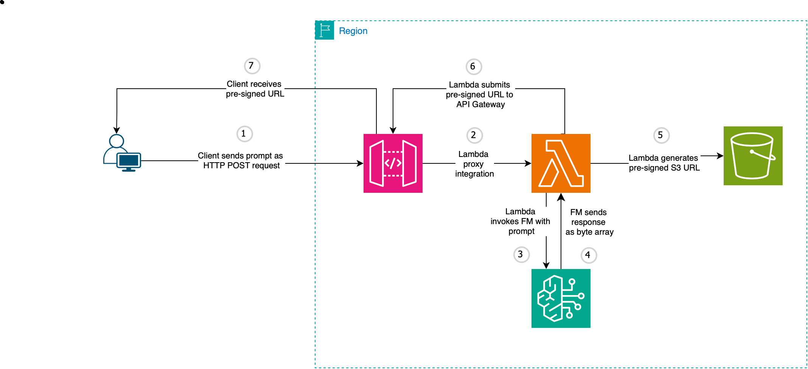

# Bedrock Image Generator

Image generator app that generates a GenAI image via Amazon Bedrock based on a textual prompt.

## App architecture

* The frontend interface is built with React, and calls the AWS API Gateway.

* API Gateway forwards the body payload to a Lambda function via Lambda proxy integration.
The Lambda function then invokes the foundation model inside Bedrock and saved the resulting image inside an S3 bucket, 
before forwarding the presigned URL to API Gateway.

## CORS settings inside AWS API Gateway
1. Add the correct headers to the Lambda function:
  * `Access-Control-Allow-Headers` 
  * `Access-Control-Allow-Methods` 
  * `Access-Control-Allow-Origin`
2. Add the headers to the API Gateway Method Response with the corresponsing values.
3. Enable CORS on the Gateway. The `OPTIONS` method will be automatically created.